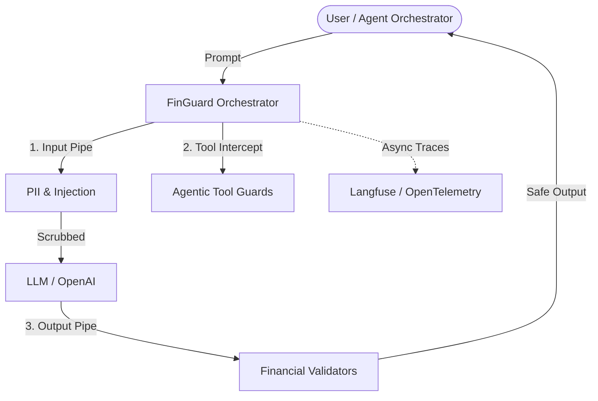

# Welcome to FinGuard 🛡️

**The Open-Source LLM Firewall for Financial AI.**

FinGuard is a high-performance orchestration layer designed to protect generative AI applications from real-world enterprise threats: prompt injections, PII leakage, numerical hallucinations, and agentic tool misuse.

It provides declarative security via standard YAML files, enabling SOC teams to lock down LLM flows without writing complex Python infrastructure.

## Core Philosophies

1. **Zero-Friction Integration**: We believe security tools fail if they force developers to rewrite their application logic. FinGuard provides native wrappers for `LangChain`, `LlamaIndex`, and `Vanilla` Python loops. You don't have to change your orchestrator to secure your agent.
2. **Forensic Traceability**: "Black box" firewalls are useless in an incident response scenario. FinGuard boasts out-of-the-box integration with `Langfuse` and `OpenTelemetry`. Every guard decision generates a reconstructable, immutable trace ID.
3. **Agentic Self-Correction**: When FinGuard blocks an AI action, it doesn't just crash. It raises structured exceptions (`ToolCallViolation`, `FinGuardViolation`) containing exactly *why* it was blocked, allowing your agents to intelligently self-correct and try a safer approach.
4. **Local by Default**: Financial data cannot be sent to 3rd-party guardrail APIs. FinGuard runs entirely local, leveraging highly optimized CPU ONNX runtimes for $< 15ms$ latency overhead.

## Global Architecture

## Where to go next?

- **[Installation Guide](setup.md)** — Start protecting your LLMs in 2 minutes.
- **[Protection Policies](components/policies.md)** — Understand how to configure FinGuard using declarative YAML.
- **[Agentic Tool Guards](components/tool_guards.md)** — Learn how to stop your agents from executing rogue tools.
- **[PII Anonymization](components/pii.md)** — Explore our dual engine (Presidio + Regex) for global and regional data protection.
- **[LangChain Cookbook](cookbooks/langchain_agent.md)** — Mix and match FinGuard inside a conversational React Agent.
